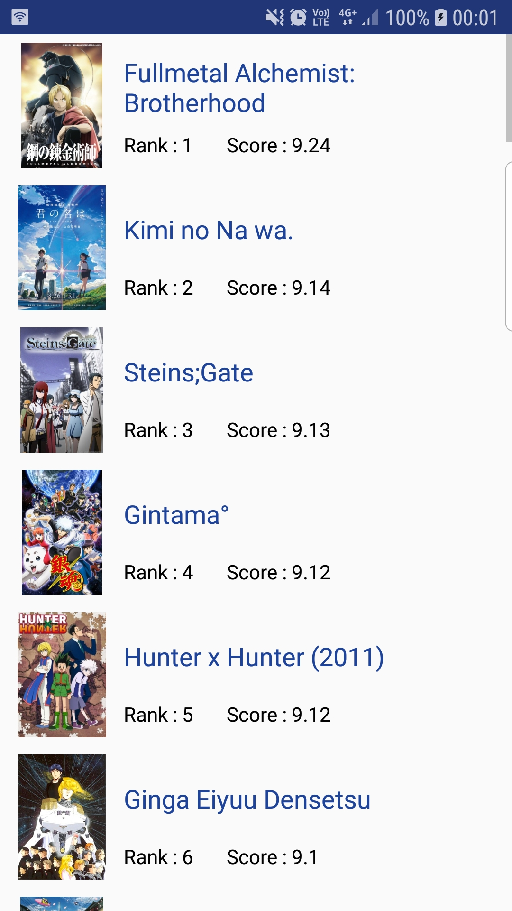
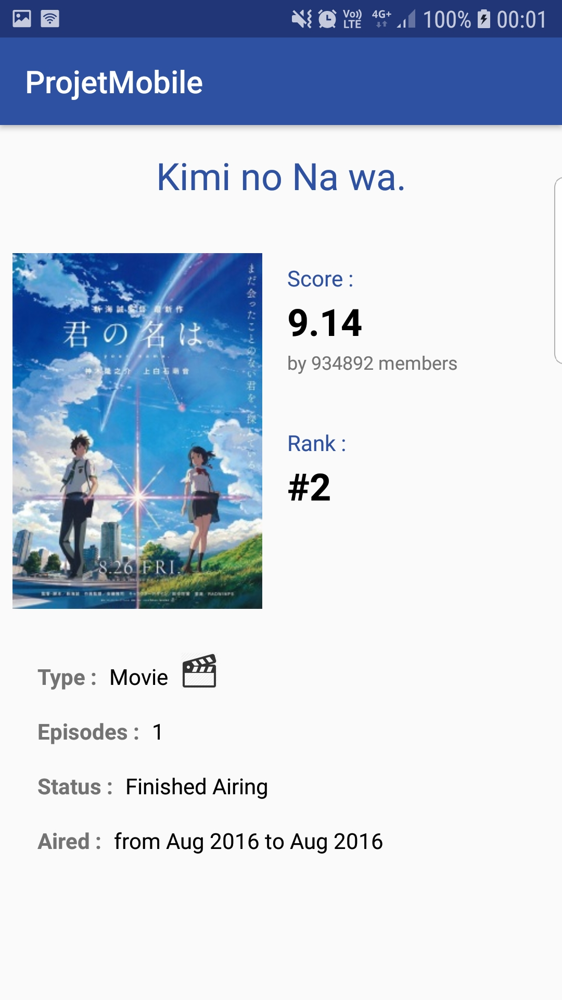

# Application MyAnimeList

Benjamin Xia, classe 31

## Présentation

Application affichant le top 50 des animes du site MyAnimeList.
Ce projet mobile met en place l'utilisation de l'API Jikan. La liste des objets est affichée via RecyclerView et le projet utilise une architecture MVC.

## Consignes :
- Appel à une API REST
- Affichage d'une liste par RecyclerView
- Affichage des détails d'un objet
- Architecture MVC

## Fonctionnalités :

### Liste
Liste du top 50 des animes selon le site MyAnimeList

### Détails
Détails de l'anime

